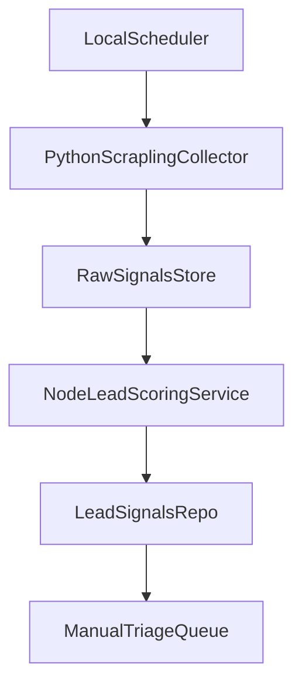

# Plan de acción: replicar funcionalidades tipo Trigify en local

## Objetivo del MVP
Construir una solución local que detecte señales en LinkedIn, persista hallazgos y asigne scoring de lead para priorización comercial, sin depender de Trigify.

## Alcance confirmado
- Stack: microservicio Python con Scrapling, integrado al bot/stack Node existente.
- MVP funcional: detección + guardado + lead scoring.
- Fuera de alcance inicial: alertas automáticas, CRM sync, outreach automático.

## Base técnica y encaje en este repo
- Núcleo operativo actual (Node/TS): [c:\Users\Dell\Agus\presales agents\README.md](c:\Users\Dell\Agus\presales agents\README.md)
- Decisiones de arquitectura actuales (provider/tool registry/persistencia híbrida): [c:\Users\Dell\Agus\presales agents\docs\decisiones-tecnicas.md](c:\Users\Dell\Agus\presales agents\docs\decisiones-tecnicas.md)
- Referencia de capacidades de scraping a usar: [Scrapling README ES](https://raw.githubusercontent.com/D4Vinci/Scrapling/main/docs/README_ES.md)

## Arquitectura propuesta

## Diseño por componentes
- **Collector Python (Scrapling)**
  - Servicio independiente para scraping con sesiones persistentes, fetcher stealth y retries.
  - Salida estructurada en JSON (post_url, author, company, text, timestamp, engagement).
  - Estrategia de resiliencia: checkpoint/pause-resume para corridas largas.
- **Ingesta/normalización en Node**
  - Endpoint o job consumidor que valida payloads y normaliza campos.
  - Dedupe por clave compuesta (`post_url + author + fecha_bucket`).
- **Motor de scoring (Node)**
  - Scoring híbrido por:
    - coincidencia de temas/keywords,
    - señales de intención (pregunta explícita, dolor, comparación, pedido de recomendación),
    - bonus opcional por cuenta objetivo.
  - Resultado: `score_total`, `score_breakdown`, `why_fit`.
- **Persistencia**
  - Nueva entidad `lead_signals` separada de `companies` y `leads` existentes.
  - Estado inicial de lifecycle: `new`, `reviewed`, `discarded`.

## Fases de implementación
- **Fase 1 — Contratos y datos (rápida)**
  - Definir schema de intercambio Python -> Node.
  - Diseñar schema de almacenamiento `lead_signals` + índices mínimos.
- **Fase 2 — Collector con Scrapling**
  - Implementar spider/collector con sesiones, rotación de proxy configurable y manejo de bloqueos.
  - Exportar lote JSON local estable para pruebas.
- **Fase 3 — Pipeline Node**
  - Ingesta, validación, dedupe y persistencia híbrida (alineado al patrón del repo).
  - Implementar scoring y guardado del breakdown explicable.
- **Fase 4 — Operación local**
  - Scheduler local (intervalos configurables).
  - Métricas básicas: volumen detectado, ratio dedupe, distribución de score.
- **Fase 5 — Hardening inicial**
  - Tests de comportamiento: dedupe, parseo de señales, scoring boundaries.
  - Políticas de rate limiting y backoff para estabilidad.

## Criterios de aceptación MVP
- El collector produce datos estructurados repetibles en ejecución local.
- El pipeline persiste señales sin duplicados evidentes.
- Cada señal persistida contiene score total y razones trazables.
- El sistema soporta corridas periódicas sin intervención manual constante.

## Riesgos y mitigación
- Riesgo de bloqueo anti-bot/cambios DOM.
  - Mitigar con selectors adaptativos, retries y aislamiento del collector.
- Riesgo legal/compliance por scraping social.
  - Mitigar con revisión legal previa, menor frecuencia y captura mínima necesaria.
- Riesgo de ruido alto en scoring inicial.
  - Mitigar con umbral conservador y calibración semanal con feedback humano.

## Entregables
- Microservicio Python `collector` con Scrapling y configuración local.
- Contrato JSON de señales documentado.
- Nuevo repositorio/tabla de `lead_signals` con lifecycle.
- Motor de scoring en Node con salida explicable.
- Suite de pruebas de comportamiento para ingesta/dedupe/scoring.